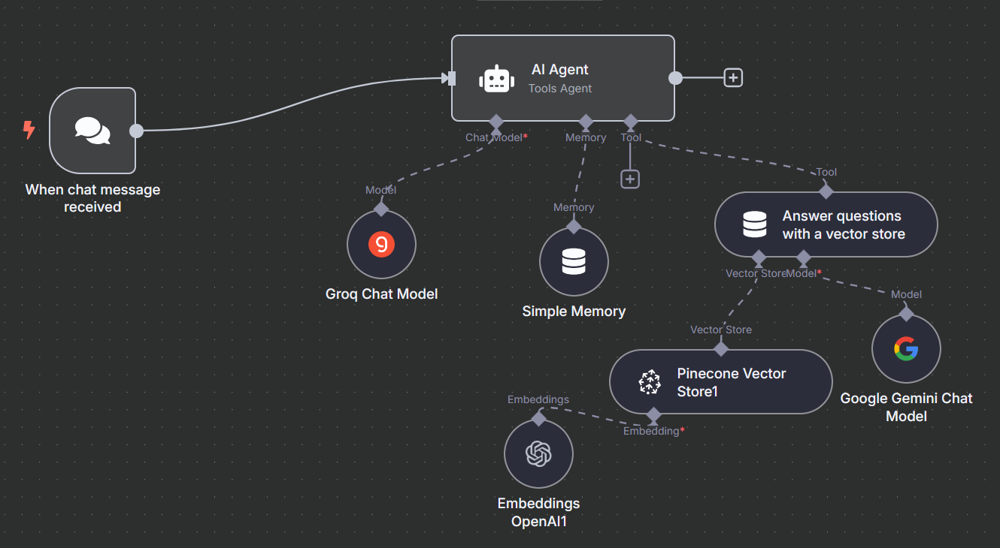
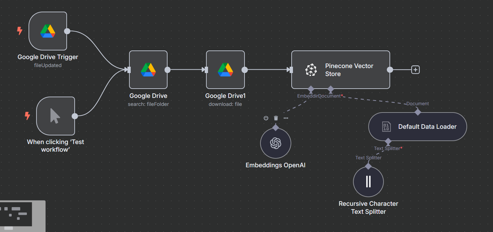

## RAG Workflow with n8n

This repository hosts an Agentic Retrieval-Augmented Generation (RAG) workflow built using n8n, designed to provide information from machine learning-related documents stored in Google Drive.   

The workflow leverages Pinecone as a vector database, OpenAI Text Embeddings 3 Small for embedding generation, LLaMA3 70B-8192 (via Groq) as the primary LLM, and Gemini 1.5 Flash for validating and reasoning over vector store queries. 
The system uses simple storage for context retention and automatically updates the Pinecone database when documents are added or modified in Google Drive.

feel free to copy the JSON workflow and add your own API credentials.

See it in action here: https://drive.google.com/file/d/1CS0g856ZWGD2MeZp8XA3M0F3zE0zNL9v/view?usp=sharing

Tools used

---
Made with ❤️ by [Subhanu](https://github.com/subhanu-dev)
